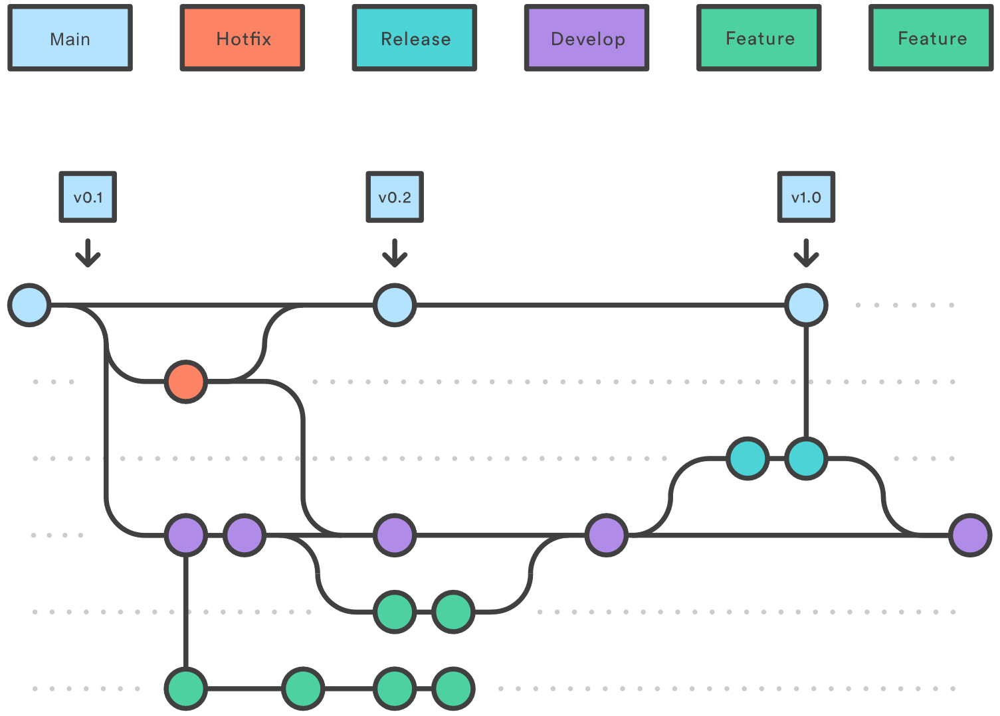
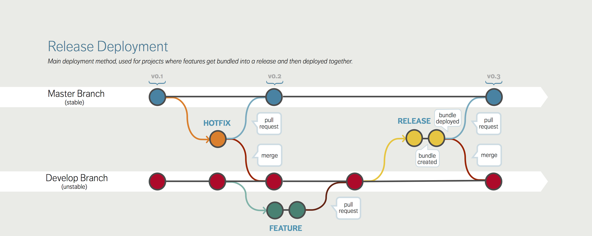
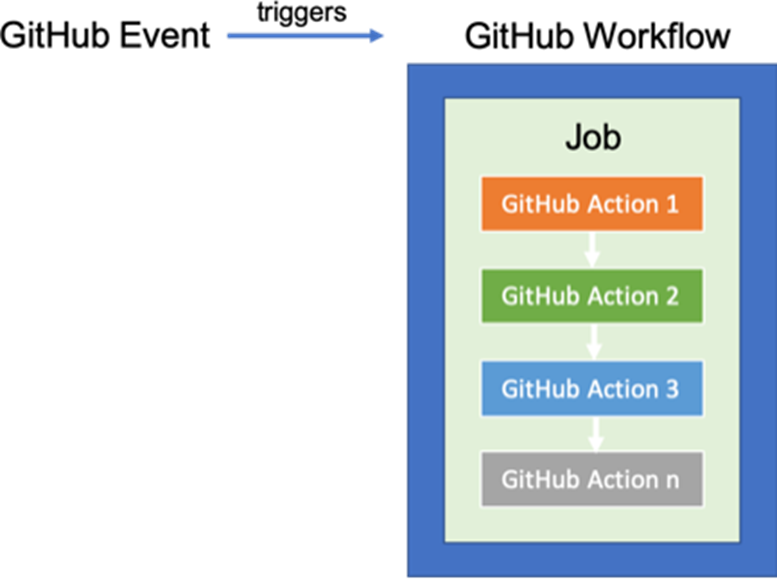

# GitHub Actions for Salesforce Development CI/CD
This repository includes ready-to-use GitHub Actions templates that automate common Salesforce development tasks, such as deployment, testing, and code quality checks. The workflows are designed to streamline your Continuous Integration / Continuous Delivery (CI/CD) pipeline and provide a seamless integration with your Salesforce development lifecycle.

## Branching Strategy and Git Flow for CI/CD Process
### What is Git Branching Strategy?
- A Git Branching Strategy defines the pattern for managing Git branches in a repository. It specifies when and how to create branches, what each branch represents, and when branches should be merged back. Using a well-defined strategy helps maintain code quality and ensures smoother collaboration between developers.

## Git Flow
- The Git Flow workflow is an established branching model that defines a structured approach to managing feature development, releases, and hotfixes. Below is the step-by-step process that our team follows for CI/CD using GitHub Actions and Git Flow.

## Step 1: Working on a New Feature
  - Start by working on your feature locally in your Salesforce developer sandbox using Visual Studio Code (VS Code).
  - Deploy changes to your developer sandbox org and test your feature.
  - Create a feature branch from the develop branch when the feature is ready for further work. The naming convention is as follows:
    Example: feature/US-000567-ShowToastEnhancements
  - Push your changes to the feature branch both locally and remotely. Ensure the feature branch is up to date with develop.
  - Commit and Push your changes to the remote feature branch.
## Step 2: Creating a Pull Request (PR) for QA
  - Once your feature is ready for QA, create a Pull Request (PR) from the feature branch to the develop branch.
  - Assign a reviewer to review your changes and provide feedback.
  - As soon as you create the PR, a GitHub Action will automatically run to validate your changes against the QA environment.
  - If the reviewer provides feedback and rework is required, synchronize your feature branch with the latest changes, push updates, and the GitHub Action will validate the changes against the QA environment again.
  - Once your changes are validated and approved, merge the PR from the feature branch to the develop branch.
  - Upon merging, a GitHub Action will trigger and deploy the changes to the QA environment.
## Step 3: Bug Fixes (If Necessary)
  - If any bugs are discovered during QA, create a bugfix branch from develop.
    Example: bugfix/feature/US-000567-ShowToastEnhancements
  - After fixing the bug, create a PR from the bugfix branch to develop and assign a reviewer.
  - A GitHub Action will validate the bugfix against the QA environment.
  - Once reviewed and approved, merge the bugfix branch into develop. This will trigger a deployment of the bugfix to the QA environment.

## Step 4: Preparing for a Release
  - Before you go live with a release, ensure all approved features are integrated into a release branch.
  - Case 1: All Features Are Ready for Release
    Create a release branch from the develop branch:
    bash
    Copy code
    git checkout develop
    git checkout -b release/v1.0
    Merge develop into the release branch and validate the release by triggering a GitHub Action deployment to the QA environment.
    Once the release is stable, create a PR from the release branch to the main branch.
    The GitHub Action will validate the code against the production environment.

 - Case 2: Partial Features Ready for Release
    If not all features are ready, create the release branch from main and cherry-pick the approved commits:
    bash
    Copy code
    git checkout main
    git checkout -b release/v1.0
    git cherry-pick <commit-hash-feature1>
    git cherry-pick <commit-hash-bugfix1>
    Ensure that all bugfixes are also cherry-picked into the release branch.
    Use manual triggers to run the GitHub Action validation after all commits are cherry-picked and ready for validation.

## Step 5: Final Steps for Release
- Once the release branch has been validated, merge the release branch into both the main and develop branches to ensure all branches are up to date.
- Delete the release branch after the release.
- Communicate the release status with the team and ensure deployment is completed successfully.
- Perform manual deployment to production using the quick deploy button and run post-deployment checks.

 

## Handling Merge Conflicts
- Feature Merges: If multiple developers are working on the same code area, ensure that you frequently merge develop into your feature branch to resolve conflicts early.
  Resolve merge conflicts manually by reviewing the conflicting changes and ensuring the correct code is merged.
  Rollbacks and Partial Rollouts

## Rolling Back Features in develop:
If a feature causes problems in the develop branch, revert the problematic commit using:

git revert <commit-hash>
This creates a new commit that undoes the change while preserving the rest of the work.

- Reverting in Production:
  If an issue arises after deployment to production, revert the specific commit on the main branch and synchronize this change with develop to maintain consistency.

## Partial Rollouts:
- You can cherry-pick specific features from the develop branch into a release branch, leaving unfinished work in develop. This is useful when some features are ready for release while others need more development.

## GitHub Workflows
- GitHub workflows are configuration files that define the order of execution for GitHub Actions. These workflows are defined in YAML files and are used to automate the build, test, and deployment process for your Salesforce applications.

## Visual Representation of Workflow

## Conclusion
- By following this Git Flow strategy, developers can efficiently manage features, bug fixes, releases, and rollbacks while automating deployments and testing using GitHub Actions. This setup ensures smoother collaboration, more controlled releases, and a stable production environment.